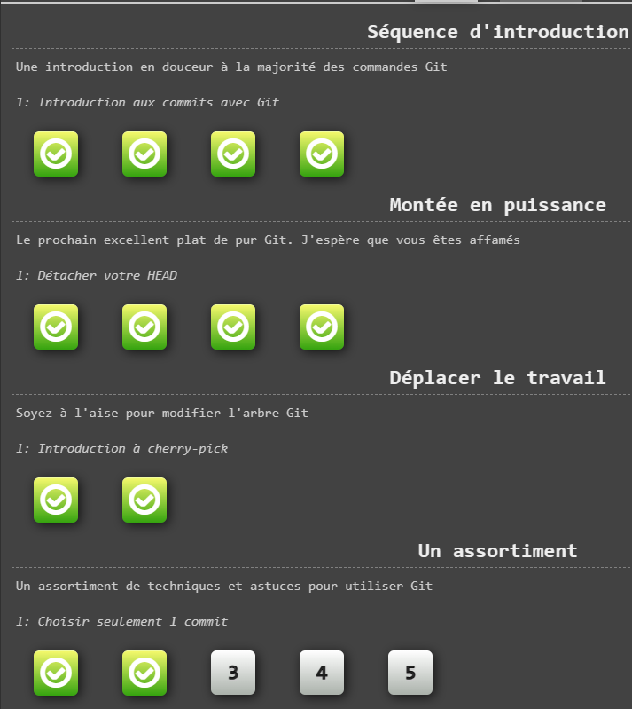

# TP GIT:
## Exercice 1:
Copier le repository:  
`
git clone https://LSchott15@bitbucket.org/testtpdevops/bitbucketstationlocations.git  
`  
Aller dans le repository:  
`  
cd nom_du_repository
`  
Créer un fichier avec du contenu:  
`  
echo "test">>test.txt  
`  
Obtenir l'état:  
`  
git status  
`  
Ajouter les changements du fichier test.txt:  
`  
git add test.txt  
`  
On revérifie l'état:  
`  
git status  
`  
Commit avec message:  
`  
git commit -m "test.txt file added"  
`  
Pousser le commit:  
`  
git push  
`  
Récupérer les modifications:  
`  
git pull  
`  
Créer une branche et aller dessus:  
`  
git checkout -b nouvelle_branche  
`  
Changer de branche:  
`  
git checkout nouvelle_branche  
`  
Merge une branche:  
`  
git merge nouvelle_branche  
`  
Supprimer une branche:  
`  
git checkout -d nouvelle_branche  
`  
## Exercice 2:
  

### Liste des solutions:  
### 1  
`
git commit
git commit
`
### 2
`
git checkout -b bugFix 
`
### 3
`
git checkout -b bugFix git commit git checkout main git commit git merge bugFix
`
### 4
`
git checkout -b bugFix git commit git checkout main git commit git 
checkout bugFix git rebase main
`
### 5
`
git checkout C4
`
### 6
`
git checkout C3
`
### 7
`
git checkout HEAD^  
git branch -f main c6
git branch -f bugFix HEAD^
`
### 8
`
git checkout pushed
git revert c2
git checkout local
git reset
`
### 9
`
git cherry-pick c3 c4 c7
`
### 10
`
git rebase -i main~4 --aboveAll;
`
### 11
`
git checkout main
git cherry-pick c4
`
### 12
`
git rebase -i caption~2 --aboveAll;
git commit --amend;
git rebase -i caption~2 --aboveAll;
git branch -f master caption;
`